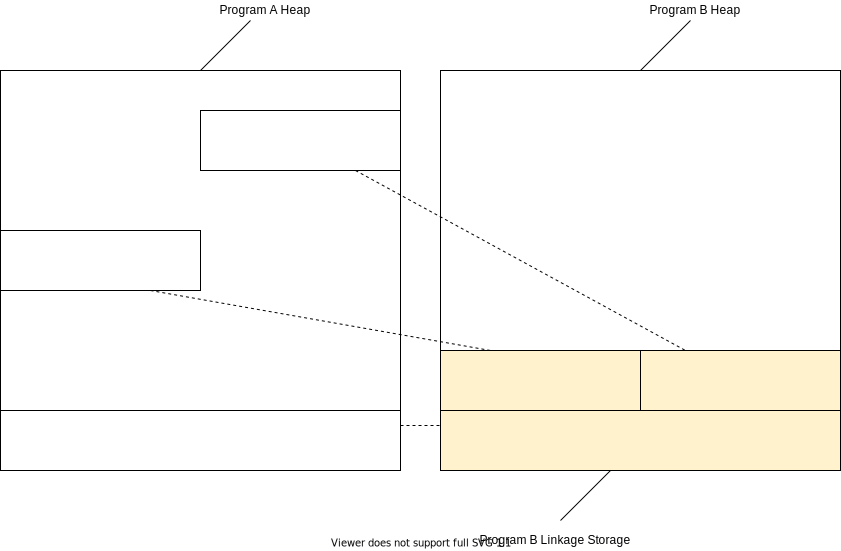

# Variables / Heap

A Cobol program can call subprograms with 'arguments' usinging the `USING` Keyword.
With this, the arguments are passed by reference.
If, on the caller side, `USING BY CONTENT` is used, the parameters are passed by value.

The problem here is, that you can pass values with a specific into a subprogramm, and the subprogram uses another representation.
To disallow such a behaviour, only `COPY` is allowed inside the `LINKAGE SECTION`.
The caller must use the same definitions in the same order.

**TODO**: Do the thing described above. it should be a compile time error if this is not the case.

The heap is implemented as an (Array-)List with Characters + a HashMap containing a mapping a variable name to a pointer.

This List will be further refered to as the Heap.

A pointer contains:
  - Start Position in the Heap
  - Length of the Variable
  - The default value (used for initialize)
  - (A reference to the heap)
  - TODO

**TODO**: Pointer Specialication (Number, String, ...)

Because of this, a `REDEFINES` is implemented as another pointer, pointing to the same place in the heap.

The yellow part in the Program B does not exist really if call by reference is used.
The pointer in the hash map just points to the program a map.

The Heap can be constantly appendend to, but there is nothing planned to remove anything.

## Planned / TODO

- Support for Arrays (Tables) => Where should the index be saved?
- Currently the Initialize is run when adding a variable to the heap.
  This may be incorrect and should be called when calling a program (Like in a constructor)
- Allow call by value
- ...